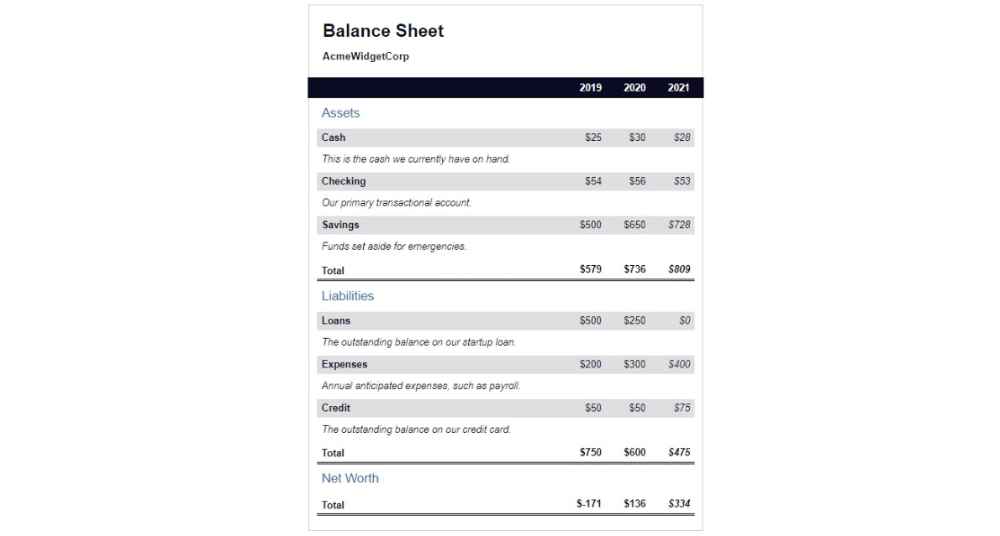

# Learn More About CSS Pseudo Selectors By Building A Balance Sheet

In this course, you'll build a balance sheet using pseudo selectors. You'll learn how to change the style of an element when you hover over it with your mouse, and trigger other events on your webpage.

### Below is the reult of my build
